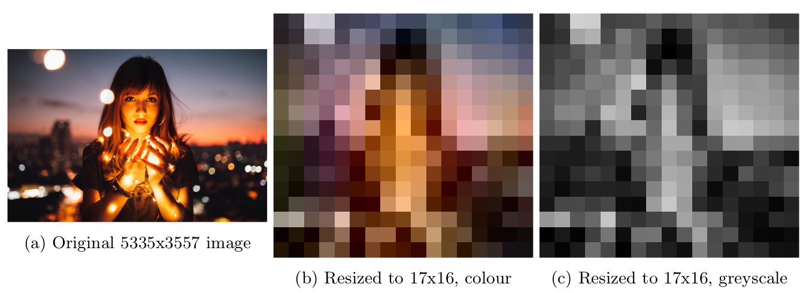
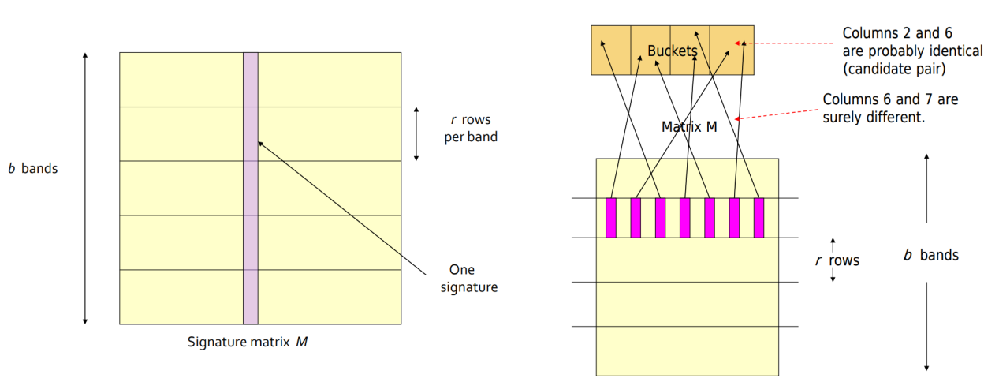
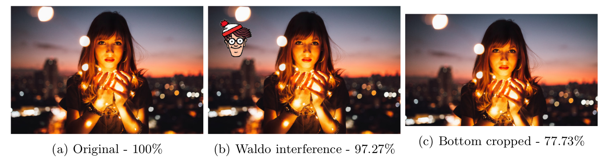

# LSH for near-duplicate image detection
This proof-of-concept uses **Locality Sensitive Hashing** for near-duplicate image detection 
and was inspired by Adrian Rosebrock's article 
[Fingerprinting Images for Near-Duplicate Detection](https://realpython.com/fingerprinting-images-for-near-duplicate-detection/). 
At the end of the article,
the author proposes to use  K-d trees or VP trees to achieve real near-duplicate detection in a 
scalable way. This page explains how to achieve that with Locality Sensitive Hashing instead.

> **Note**: Instructions on how to run the proof-of-concept code can be found at the [bottom of this page](#running-the-poc-code).

## Pre-processing: from image to signature
In this pre-processing step the idea is to compress images into smaller signatures while preserving the
similarity between the two. If two images are similar, so should their signatures be. It makes sense to
use the same image hashing function from the source article to do this: ```dhash``` (difference hash) from
the Python image hashing library ```imagehash```.

This ```dhash``` function does the following for a given k (k = 8 for example):
1. Resize the image to (k + 1) × k pixels. For k = 8 this reduces the image to 72 pixels.
2. Convert to greyscale, so we go from 72 pixels to 72 light intensity values
3. Compute the difference between horizontally adjacent light intensity values. Comparing 9 values
per row gives 8 differences per row. Since we have 8 rows we’re now working with 64 values.
4. Convert the differences to bits (0 if the difference ≤ 0, 1 if the difference > 0)
We now have a 64-bit (with k = 8) signature of our image, representing the light intensity differences
between horizontally neighbouring pixels. This seems to work remarkably well in near-duplicate detection.
It’s important that comparing two signatures is a good proxy for comparing the similarity between
two images. This process should take care of that. In a later step, we can compare signatures bit-wise
using the Hamming distance.
Below a k = 16 example showing the different pre-processing steps:


This last greyscale picture can then be used to build the 256-bit (16^2) signature based on the difference in light
intensities between the pixels, yielding the bitstring below. With a bit of effort, you can see the outline of the
person captured by the 1's.

    1 1 1 0 1 1 1 0 1 1 0 0 0 0 0 0
    1 1 1 0 1 1 0 0 1 1 1 0 0 0 0 0
    1 1 1 1 1 0 0 0 0 1 1 0 0 0 0 0
    1 1 1 1 1 0 0 1 0 1 1 0 0 0 0 0
    1 1 1 1 1 1 0 1 0 0 1 0 0 0 0 0
    1 1 1 1 1 0 1 1 0 0 1 1 0 0 0 0
    1 1 0 1 1 0 1 1 0 0 1 1 0 0 0 0
    1 1 0 1 1 0 0 1 0 0 1 1 0 0 0 0
    1 0 1 1 1 0 1 1 0 0 0 1 1 0 0 0
    1 0 1 1 0 1 1 1 1 0 0 0 1 1 0 0
    1 0 1 0 0 1 1 1 1 0 0 1 1 1 0 1
    0 1 1 1 0 1 1 1 0 0 0 1 1 0 1 1
    1 0 1 0 0 1 1 1 0 0 0 1 0 1 0 1
    1 0 1 1 0 0 1 1 1 0 0 0 0 0 1 1
    0 0 1 1 0 1 1 0 1 1 0 1 0 0 1 0
    1 1 1 0 0 1 0 0 1 1 0 0 0 1 0 1

## Generating candidate pairs
Now instead of comparing the signatures to eachother, we will break up each signature in b bands of r
rows (bits). This of course means that b · r = k^2 with k^2 our signature length. We will then apply b
hash functions - 1 for every band - to all signatures substrings (pieces of r bits) in band b. If any of
those signature substrings end up in the same bucket for any of the hash functions, we’ll consider those
signatures - and their related files - candidate (near-duplicate) pairs.



We can influence the sensitivity of candidate pair detection by tuning the b and r parameters, if we
take fewer but wider bands, it becomes less ”easy” for signature substrings (bands) to hash to the same
bucket and vice versa.

## Post-processing: checking candidate pairs
Since it’s likely that this process creates some false positives, a post-processing step is necessary where
we actually compare the signatures of our candidate pairs to eachother. This allows us to check whether
they’re actually near-duplicates and to what extent. We do this by calculating the Hamming distance
between two signatures, ie. the number of bits where both signatures are different. If that number divided
by the signature length ( Hamming Distance / k^2 ) is lower than a self-defined threshold t, we can consider them
near-duplicates. We can choose t for example to be 0.8 in order to consider images that are 80% similar
as near-duplicates.

## Example
Below the result of a near-duplicate scan using the Locality Sensitive Hashing method described above
with k = 16 (hash size), b = 32 (bands) and r = 8 (rows). The original picture is on the left, the one with
Waldo in the middle was matched with 97.27% similarity and the cropped one on the right with 77.73%
similarity. The Hamming distance was used to calculate the similarity after these pictures hashed for 1
or more bands to the same bucket.



The 256-bit signatures of these 3 files are listed below, separated into 32 bands that can be read from
left to right, top to bottom to get the full signature. Bands that are different compared to the original
have been prefixed with ```>```:

```
 Original:
 11101110 11000000 11101100 11100000 11111000 01100000 11111001 01100000
 11111101 00100000 11111011 00110000 11011011 00110000 11011001 00110000
 10111011 00011000 10110111 10001100 10100111 10011101 01110111 00011011
 10100111 00010101 10110011 10000011 00110110 11010010 11100100 11000101

 Waldo interference:
 11101110 11000000>01101100>11100000>10011000 01100000>10011001 01100000
>11011101 00100000>11011011 00110000 11011011 00110000 11011001 00110000
 10111011 00011000 10110111 10001100 10100111 10011101 01110111 00011011
 10100111 00010101 10110011 10000011 00110110 11010010 11100100 11000101

 Bottom cropped:
 11101110 11000000 11101100>11000000>11101100 01100000 11111001 01100000
 11111101 00100000>11111101 00110000>11111011 00110000>11011011 00110000
>11011001>00110000>10011011>00111000>10110111>00001000>10100101>10001100
>00100111>00011011>01110111>00011011>10100011>10010111>10110010>10000011
```

## Running the PoC code
Clone this repository and from within it run:
```shell
$ pip install -r requirements.txt  # installs imagehash library and dependencies

$ python3 detect.py -i input
Found 3 near-duplicate images in input/ (threshold 90.00%)
99.61% similarity: file 1: input/girl_lights.jpg - file 2: input/girl_lights_shrunk_to_1334x889.jpg
96.88% similarity: file 1: input/girl_lights_shrunk_to_1334x889.jpg - file 2: input/girl_lights_waldo.jpg
96.48% similarity: file 1: input/girl_lights.jpg - file 2: input/girl_lights_waldo.jpg
```
For other parameters like threshold, hash size, ... run `python3 detect.py --help`

## References
- Article: [Fingerprinting Images for Near-Duplicate Detection](https://realpython.com/fingerprinting-images-for-near-duplicate-detection/)
- How dhash works: [Kind of like that](http://www.hackerfactor.com/blog/index.php?/archives/529-Kind-of-Like-That.html)
- MIT's Alex Andoni's page on [Locality Sensitive Hashing](http://web.mit.edu/andoni/www/LSH/index.html)
- Photo of girl with lights by Matheus Bertelli [picture](https://www.pexels.com/photo/adolescence-attractive-beautiful-blur-573299/)
